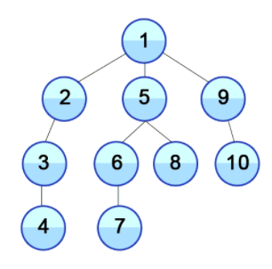
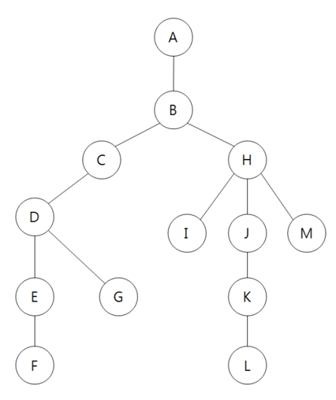

# 그래프 탐색

## 1. BFS(Breadth First Search): 너비 우선 탐색

BFS(너비 우선 탐색)이란 너비를 우선으로 그래프로 탐색하는 기법으로, 시작점인 루트 노드와 같은 거리에 있는 노드를 우선으로 방문한다.

위의 그래프를 예시로, 같은 level의 노드들을 먼저 순서대로 탐색해나가는 것을 볼 수 있다.

 

## DFS(Depth First Search): 깊이 우선 탐색

DFS(깊이 우선 탐색)이란 깊이를 우선으로 그래프를 탐색하는 기법으로, 루트 노드로부터 갈 수 있는 한 끝까지 탐색해 리프 노드를 방문하고, 이전 갈림길에서 선택하지 않았던 노드를 방문하는 식으로 전체 노드를 순차적으로 탐색하는 방식이다.

 

#### 구현

~~~python
# Graph
graph = {
    'A': ['B'],
    'B': ['A', 'C', 'H'],
    'C': ['B', 'D'],
    'D': ['C', 'E', 'G'],
    'E': ['D', 'F'],
    'F': ['E'],
    'G': ['D'],
    'H': ['B', 'I', 'J', 'M'],
    'I': ['H'],
    'J': ['H', 'K'],
    'K': ['J', 'L'],
    'L': ['K'],
    'M': ['H']
}

# BFS 구현
def bfs(graph, start_node):
    visit = []
    queue = []
    
    queue.append(start_node)
    
    while queue:
        node = queue.pop(0)
        if node not in visit:
            visit.append(node)
            queue.extend(graph[node])
            
    return visit

# DFS 구현
def dfs(graph, start_node):
    visit = []
    stack = []
    
    stack.append(start_node)
    
    while stack:
        node = stack.pop()
        if node not in visit:
            visit.append(node)
            stack.extend(graph[node])
            
    return visit

# 실행
print(bfs(graph, 'A'))
print(dfs(graph, 'A'))
~~~

 

> #### References
>
> [1] https://cyc1am3n.github.io/2019/04/26/bfs_dfs_with_python.html
>
> [2] https://itholic.github.io/python-bfs-dfs/

