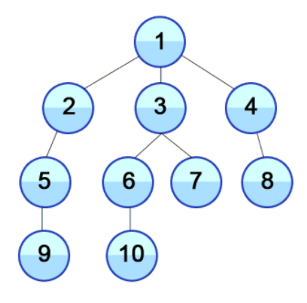

# 그래프 탐색

## 1. BFS(Breadth First Search): 너비 우선 탐색

 BFS(너비 우선 탐색)이란 너비를 우선으로 그래프로 탐색하는 기법으로, 시작점인 루트 노드와 같은 거리에 있는 노드를 우선으로 방문한다.

위의 그래프를 예시로, 같은 level의 노드들을 먼저 순서대로 탐색해나가는 것을 볼 수 있다.

 

#### 구현

(업데이트 예정)

> #### References
>
> [1] https://cyc1am3n.github.io/2019/04/26/bfs_dfs_with_python.html