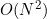

## 1. 선택 정렬 : Selection Sort

정렬되어 있지 않은 데이터 중 가장 작은 데이터를 선택하여 맨 앞부터 순서대로 정렬해 나가는 알고리즘 입력 배열이 이미 정렬되어 있거나 말거나 상관없이 동일한 연산량을 갖기 때문에 최적화의 여지가 적어 성능이 떨어지는 편 

가장 구현이 쉬운 정렬 알고리즘

* 시간복잡도 :  

  루프문을 통해 모든 인덱스에 접근 : , 최소값을 찾으면 현재 인덱스와 swap : 

#### 구현

~~~python
def selection_sort(arr):
    for i in range(len(arr)-1):
        min_idx = i
        for j in range(i+1, len(arr)):
            if arr[j] < arr[min_idx]:
                min_idx = j
        arr[i], arr[min_idx] = arr[min_idx], arr[i]
    return arr
~~~

## 2. 거품 정렬 : Bubble Sort

뒤에서부터 앞으로 정렬을 진행하는 구조 

배옆 내의 값들을 앞뒤로 서로 비교하며 자리를 바꾸는 작업 반복 

작은 값을 앞으로 가져오겠다라는 개념을 반대로 이용하여 큰 값을 뒤로 보내며 원소들끼리 위치를 변경하는 모습이 물방울이 이동하는 것과 같이 보여서 Bubble Sort라는 이름 명명 

큰 값들을 뒤에서부터 앞으로 하나씩 쌓아나가게 됨, 원소가 자리를 잡을때마다 정렬 범위가 하나씩 줄어들게 됨 

제일 작은 값을 찾아 맨 앞에 위치시키는 선택정렬과는 정 반대의 정렬방향 

타 정렬 알고리즘에 비하여 swap이 빈번히 일어남

* 시간복잡도 : 

  루프문을 통해 모든 인덱스에 방문 : , 인접한 원소와 대소비교 및 swap : 

#### 예시

1. Initial : [5, 3, 4, 1, 2]
2. Pass 1 : [3, 4, 1, 2, 5]
3. Pass 2 : [3, 1, 2, 4, 5]
4. Pass 3 : [1, 2, 3, 4, 5]

#### 구현

~~~python
def bubble_sort(arr):
    for i in range(len(arr)-1, 0, -1):
        for j in range(len(i)):
            if arr[j] > arr[j+1]:
                arr[j], arr[j+1] = arr[j+1], arr[j]
    return arr
~~~

## 3. 삽입 정렬 : Insertion Sort

모든 요소를 앞에서부터 정렬 범위를 확장시켜나가며 정렬 진행

이미 정렬된 배열 부분과 확장된 범위 부분을 비교하며, 자신의 위치를 찾아 삽입함으로써 정렬 완성

선택, 거품 정렬과는 달리 정렬이 진행될수록 범위 넓어짐

outer루프는 순방향, inner루프는 역방향으로 반복 진행

* 시간복잡도 : 

  루프문을 통해 정렬 범위를 2개로 시작하여 전체로 확장해 나아가기 때문에 기본적으로 시간을 소모하며, 각 회차마다 정렬 범위에 추가된 값과 기존 값들과의 대소 비교 및 swap을 위해 의 시간이 추가적으로 소모된다.

#### 구현

~~~
~~~

