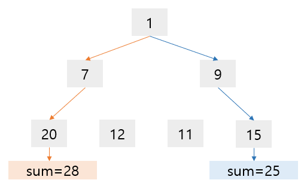

# Greedy Algorithm : 탐욕 알고리즘그

그리디 알고리즘이란, 문제를 해결하는 과정에서 순간순간마다의 최적의 선택을 하는 방식이다.

* 현재 상황에서 가장 좋다고 생각하는 것을 선택
* 이러한 선택 방법이 가장 좋을 것이라고 기대

하지만, 실제로는 이 선택 방법이 항상 최적의 답을 구해주지는 않아서 정당성 분석이 필요하다.

 

#### 정당성

숫자들의 가장 큰 sum을 구하기 위해 탐욕 알고리즘을 사용했을 경우,

* Step 1 : 1에서 시작
* Step 2 : [7, 9] 라는 현재의 선택지에서 최대 sum을 만드는 9 선택
* Step 3 : [11, 15] 라는 현재의 선택지에서 최대 sum을 만드는 15 선택
* 최종 output : sum=25

현재 상황의 최적 선택이 가장 좋을 것을 기대하는 알고리즘이지만, 위와 같은 상황에서는 적합하지 않다. 실제로는 1-7-20을 선택했을 때 가장 큰 sum을 만들 수 있었다.

이처럼, Greedy 알고리즘의 목적은 **전역(global) 최적화**이지만, 실제로는 **국소(local) 최적화** 수치를 구하게 된다.

 

#### 구현

대표적인 예시) 거스름돈의 개수를 가장 적게 주는 방법 찾기

* 잔돈 리스트 = [1, 50, 100, 500]
* 총 금액 = 658

~~~python

~~~

 

> #### References
>
> [1] https://lsh-story.tistory.com/m/89?category=967010
>
> [2] https://eboong.tistory.com/202

