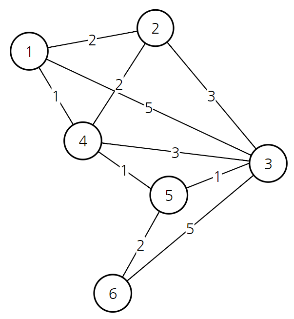
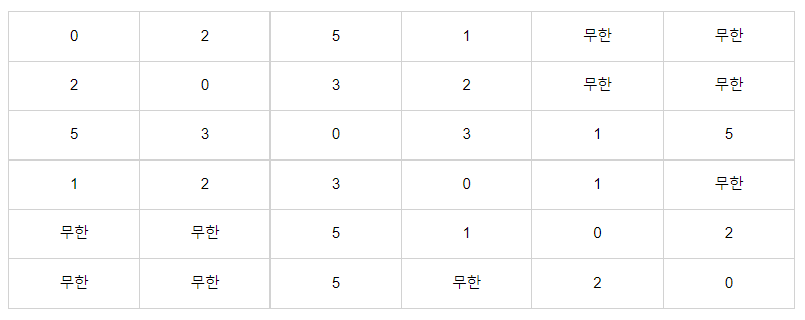

# Dijkstra : 다익스트라 알고리즘

#### 

**다익스트라** 알고리즘은 Dynamic Programming을 활용한 대표적인 최단 경로(Short Path) 탐색 알고리즘이다. 최단 거리는 여러 개의 최단 거리로 이루어져있기 때문에, 큰 문제의 부분집합에 속해있는 소문제를 사용하는 DP에 속한다. 

1. 출발 노드 설정
2. 출발 노드를 기준으로 각 노드의 최소 비용 저장
3. 방문하지 않는 노드 중에서 가장 비용이 적은 노드 선택
4. 해당 노드를 거쳐서 특정한 노드로 가는 경우를 고려하여 최소 비용 갱신
5. 위 과정에서 3~4번 반복

그래프를 실제로 컴퓨터 내에 저장해서 처리할 때는 **이차원 배열** 형태로 사용해야 함. 각 entry안에 들어가는 값은 특정 행에서 열로 가는 비용이고, 연결되어 있지 않을 경우 무한값을 사용한다.

시작 노드를 1로 설정하면, 연결되어 있고 미방문 상태인 노드 중 최단 거리 가중치를 가지는 4번 노드를 선택한다. `1->4`

다음 `1->4->5`의 비용이 1+1=2라는 걸 확인할 수 있기 때문에 matrix\[0][4]=2로 갱신해준다.

(**다익스트라 알고리즘은 현재까지 알고 있던 최단 경로를 계속해서 갱신한다.**)

다음으로 방문하지 않은 노드 중에서 가장 비용이 적은 노드는 2번 노드이므로 2번 노드를 선택한다. `1->2`

2를 거쳐서 가더라도 갱신되는 비용이 없으므로 배열은 그대로 유지한다.

5를 거쳐서 3으로 가는 경우 비용이 3이므로 기존의 4보다 더 저렴하다. `1->3`값을 3으로 갱신해주고, 마찬가지로 6으로 가는 비용도 4로 갱신해준다.

 

#### 구현

~~~python
import sys, heapq

input = sys.stdin.readline()
INF = int(1e9) #무한: 10억

node, vertex = map(int, input().split()) #노드, 간선의 개수
start_node = int(input()) #시작 노드 설정
graph = [[] for _ in range(node+1)] #그래프를 표현하는 이차원 배열
distance = [INF]*(node+1) #최단거리 테이블

for _ in range(vertex):
    a, b, c = map(int, input().split())
    graph[a].append((b,c)) #a번 노드에서 b번 노드로 가는 비용이 c
    
def dijkstra(start):
    q = []
    
    heapq.heappush(q, (0, start)) #시작 노드로의 최단경로는 0으로 설정
    distance[start] = 0
    
    while q:
        dist, now = heapq.heappop(q)
        if distance[now] < dist: #처리된 적 있는 노드라면 무시
            continue
        
        for i in graph[now]:
            cost = dist + i[1]
            if cost < distance[i[0]]:
                distance[i[0]] = cost
                heapq.heappush(q, (cost, i[0]))
                
dijkstra(start_node)

for i in range(1, n+1): #모든 노드로 가기 위한 최단 거리 출력
    if distance[i] == INF:
        print("INFINITY")
    else:
        print(distance[i])
~~~

 

> #### References
>
> [1] https://m.blog.naver.com/ndb796/221234424646
>
> [2] https://velog.io/@nyanyanyong/%EC%95%8C%EA%B3%A0%EB%A6%AC%EC%A6%98%EB%8B%A4%EC%9D%B5%EC%8A%A4%ED%8A%B8%EB%9D%BC

