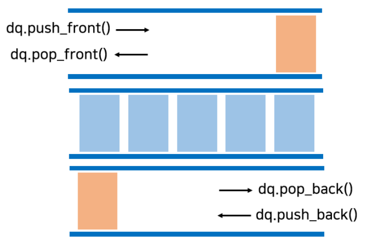

# 덱(Deque)

**Deque**는 stack과 queue의 기능을 모두 가진 자료구조로, 출입구를 양쪽에 가지고 있어서 stack처럼 쓸 수도, queue처럼 쓸 수도 있다.

front와 back 둘 다 pop과 push를 허용한다.

 

#### 시간복잡도

* 삽입, 삭제 : O(1)
* 탐색 : O(N)

 

#### 구현

1. 라이브러리 사용

~~~python
from collections import deque

dq = deque([1, 2, 3, 4, 5])
dq.append('6') #[1, 2, 3, 4, 5, 6]
dq.appendleft('0') #[0, 1, 2, 3, 4, 5, 6]
dq.clear() #비우기
dq = deque([1, 3, 4])
dq.insert(1, 2) #[1, 2, 3, 4]
dq.pop() #[1, 2, 3]
dq.popleft() #[2, 3]
~~~

 

2. 리스트 사용

~~~python
dq_list = [2, 3, 4]
dq_list.append(5) #push
dq_list.insert(0, 1)
dq_list.pop() #pop
dq_list.pop(0)
~~~

 

> #### References
>
> [1] https://velog.io/@choiiis/%EC%9E%90%EB%A3%8C%EA%B5%AC%EC%A1%B0-%EC%8A%A4%ED%83%9DStack%EA%B3%BC-%ED%81%90Queue

