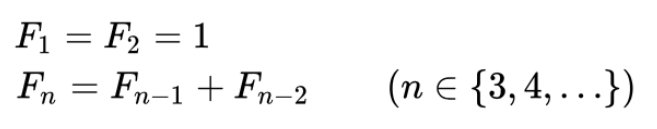

## Dynamic Programming : 동적 계획법

동적 계획법은, 주어진 문제를 여러 개의 소문제로 분할하여 각 소문제의 해결안을 바탕으로 주어진 문제를 하결하는 방법이다. 이때의 소문제는 다시 또 여러 개의 소문제로 분할 가능하고, 각 소문제는 원래 주어진 문제와 동일한 문제이지만 입력의 크기가 작다.

#### 피보나치 수열

* 피보나치 수열의 점화식

1, 1, 2, 3, 5, 8, 13, ...

* 피보나치 수열의 트리 형태 분할

소문제가 상위 문제를 해결하기 위해 사용되는 것을 볼 수 있음.

즉, 여러 개의 소문제로 분할하여 각 소문제의 해결안을 바탕으로 주어진 문제를 해결

각각의 소문제가 여러번 반복해 계산되다보니 (ex. 그림에서 F(n-3)) 자원낭비가 심해질 수 있기 때문에, 동적 계획법은 소문제의 해를 따로 저장해놓고 이를 더 큰 문제를 푸는데 이용.

#### 분할 정복(Divide and Conquer) 알고리즘과의 차이

분할 정복의 경우에는 소문제가 독립적이고, 동적 계획법은 소문제가 독립적이지 않다. 

각각 분할한 소문제들이 다른 소문제에 영향을 끼치게 된다.

* **퀵 정렬, 병합정렬 (분할 정복)** : 분할한 원소들이 정렬하는 과정에서 다른 원소들에 영향을 끼치지 않음
* **피보나치 수열(동적 계획법)** : 소문제가 상위 문제를 계산하는데 사용됨으로써 영향을 끼치게 됨. 즉, 독립적이지 않음

#### 탐욕(Greedy) 알고리즘과의 차이

탐욕법의 경우 각 단계별로 현재 상태에서 가장 최적의 경우를 판단해서 결정하기 때문에, 문제에 따라 최적해를 구할 수도 그렇지 않을 수도 있다.

하지만 동적 계획법의 경우 모든 가능성을 고려하기 때문에 어떤 문제든 항상 최적의 결과가 도출된다.

#### 동적계획법을 적용할 수 있는 문제

해결하려는 문제가 **최적성의 원리**를 만족하는지 판단해야 함.

* **최적성의 원리** : 주어진 문제의 부분해가 전체 문제의 해를 구하는데 사용되는지

#### 구현(1) : Top-Down

소문제의 해를 **메모이제이션(하향식)** 방식으로 저장하고 다시 사용

하향식(Top-Down) 방식, 즉, 하위 문제에 대한 정답을 계산했는지 확인해가며 문제를 자연스러운 방식(재귀)으로 풀어나가는 방법.

~~~python
dp = [0]*100
dp[0] = 1
dp[1] = 1

def fib(n):
    if dp[n] == 0:
        dp[n] = fib(n-1) + fib(n-2)
        
    return dp[n]

fib(10)
~~~

#### 구현(2) : Bottom-Up

소문제의 해를 **타뷸레이션(상향식)** 방식으로 저장하고 다시 사용

상향식(Bottom-Up) 방식, 즉, 더 작은 하위 문제부터 살펴본 다음 작은 문제의 정답을 이용해서 큰 문제의 정답을 풀어나가는 방법.

~~~python
def fib(n):
    dp = [0]*(n+1)
    dp[0] = 1
    dp[1] = 1
    
    for i in range(2, n+1):
        dp[i] = dp[i-1] + dp[i-2]
        
    return dp[n]

fib(10)
~~~

> #### References
>
> [1] https://lsh424.tistory.com/76