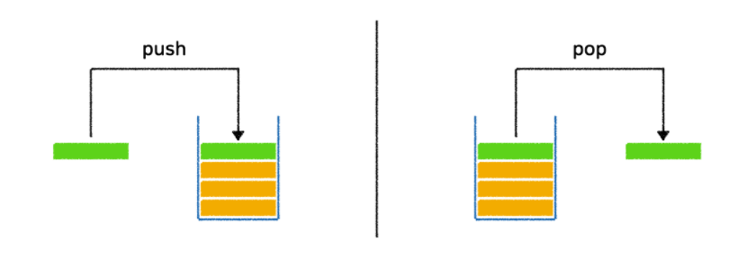
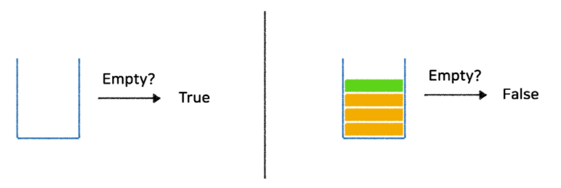

# Stack 스택

스택이란, 데이터의 삽입과 삭제가 데이터의 가장 한쪽 끝에서만 일어나는 자료구조

가장 마지막에 삽입된 데이터가 가장 먼저 사용되거나 삭제된다. (LIFO: Last In, First Out)

세로로 서있는 통과 유사 형태

 

#### 주요 Method

1. Push, Pop

   

   * Push : 데이터를 삽입하는 과정

   * Pop : 가장 마지막에 삽입한 데이터를 삭제하는 과정

     (스택에 데이터가 비어있는지 여부를 먼저 확인한 후 Pop)

2. Top

   

   * Top : 가장 마지막에 삽입한 데이터를 삭제하지 않고 Return

3. isEmpty

   

   * isEmpty : 현재 스택이 비어있는지 여부를 확인

#### 구현

~~~Python
class Stack():
    def __init__(self):
        self.stack = []
        
    def __len__(self):
        return len(self.stack)
    
    def __str__(self):
        return str(self.stack[::1])
    
    def size(self):
        return len(self.stack)
    
    def push(self, data):
        self.stack.append(data)
        
    def pop(self):
        pop_object = None
        if self.isEmpty():
            print("Stack is Empty")
        else:
            pop_object = self.stack.pop()
        return pop_object
    
    def clear(self):
        self.stack = []
    
    def top(self):
        top_object = None
        if self.isEmpty():
            print("Stack is Empty")
        else:
            top_object = self.stack[-1]
        return top_object
    
    def isEmpty(self):
        is_empty = False
        if len(self.stack)==0:
            is_empty = True
        return is_empty
    
    def isContain(self, data):
        return data in self.stack
~~~

