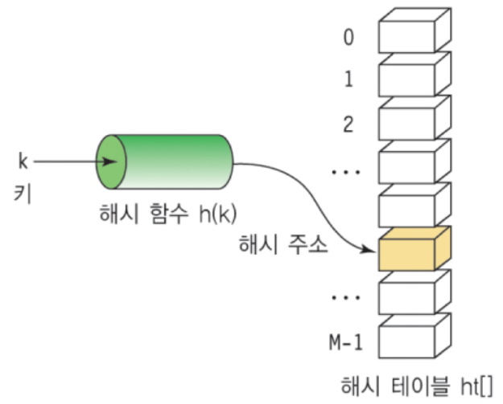

# Hash Table: 해쉬 테이블

**Hash Table**이란, 키(Key)에 데이터(Value)를 저장하는 데이터 자료구조이다. Key를 통해 바로 데이터에 접근이 가능해서 속도가 빠르고, 파이썬에서는 Dictionary 타입을 사용하면 되기 때문에 별도 구현이 필요하지 않다.

 

#### 용어

* Hash(해쉬) : 임의 값을 고정된 길이로 변환하는 것
* Hash Table(해쉬 테이블) : 키 값의 연산에 의해 직접 접근이 가능한 데이터 구조
* Hashing Function(해싱 함수) : Key에 대해 산술 연산을 이용해 데이터 위치를 찾을 수 있는 함수
* Hash Value(해쉬 값) 또는 Hash Address(해쉬 주소) : Key를 해싱 함수로 연산해서 해쉬 값을 알아내고, 이를 기반으로 해쉬 테이블에서 해당 Key에 대한 데이터 위치를 일관성있게 찾을 수 있다.
* Slot(슬롯) : 한 개의 데이터를 저장할 수 있는 공간

 

#### 시간복잡도

* 일반적인 경우 O(1)
* 최악의 경우 O(n)

 

#### 구현

~~~python
hash_table = list([0 for i in range(10)])
def hash_func(key):
    return key % 5

(추후 정리 예정)
~~~

 

> #### References
>
> [1] https://www.fun-coding.org/Chapter09-hashtable.html