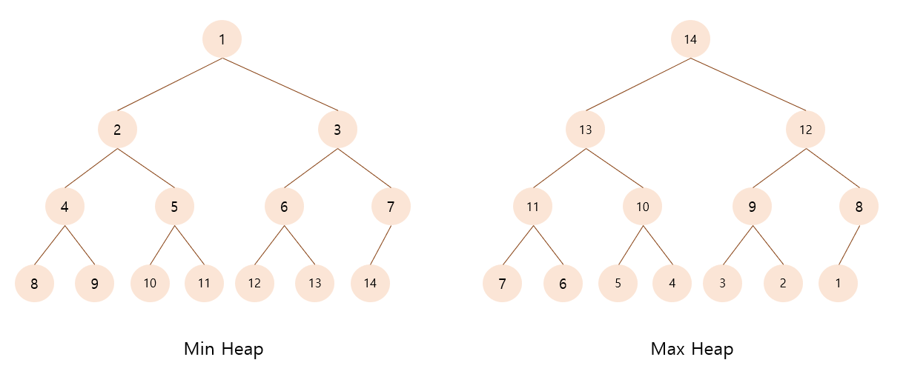
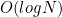

# Heap: 힙

 **Heap**(힙)이란, 최댓값과 최솟값을 빠르게 찾기위해 고안된 자료구조로, 각 노드의 key값이 해당 노드의 자식노드의 key값보다 작지 않거나 크지 않은 완전 이진트리이다. 키 값의 대소관계는 부모-자식 노드 사이 간에만 성립하며 형제 노드 사이에는 영향을 미치지 않는다. 자식노드의 최대 개수는 힙의 종류에 따라 다르지만 이진트리에서는 최대 2개이고, i번째 노드의 왼쪽 자식노드는 2i, 오른쪽 자식노드는 2i+1, 부모노드는 i/2의 값을 가진다(최소 힙).

* **Max Heap(최대 힙)** : 각 노드의 key값이 자식노드의 key값보다 큰 힙
  * key(T.parent(v)) > key(v)
* **Min Heap(최소 힙)** : 각 노드의 key값이 자식노드의 key값보다 작은 힙
  * key(T.parent(v)) < key(v)

 

#### 시간복잡도

이진트리를 사용하기 때문에 시간복잡도는 

 

#### 주요 메소드

* Insert (삽입 연산)

  삽입하고자 하는 값을 트리의 가장 마지막 원소에 추가한 후 부모노드와의 대소관계를 비교하면서 힙 조건을 만족할 때까지 자리 교환을 반복한다.

* Delete (삭제 연산)

  힙에서는 루트 노드만 삭제가 가능하기 때문에 우선 루트 노드를 제거하고, 가장 마지막 노드를 루트로 이동시킨 후엥 자식노드와 비교하여 힙 조건을 만족할 때까지 자리 교환을 반복한다.

 

#### 구현 (heapq 모듈 사용)

* 최소 힙 정렬 (오름차순)

~~~python
import heapq

def heapsort(iterable):
    h = []
    result = []
    
    for value in iterable:
        heapq.heappush(h, value)
        
    for _ in range(len(h)):
        result.append(heapq.heappop(h))
        
    return result

result = heapsort([1,3,5,7,9,2,4,6,8,0])
print(result) #[0,1,2,3,4,5,6,7,8,9]
~~~

* 최대 힙 정렬(내림차순)

~~~python
import heapq

def heapsort(iterable):
    h = []
    result = []
    
    for value in iterable:
        heapq.heappush(h, -value)
        
    for _ in range(len(h)):
        result.append(-heapq.heappop(h))
        
    return result

result = heapsort([1,3,5,7,9,2,4,6,8,0])
print(result) #[9,8,7,6,5,4,3,2,1,0]
~~~

* 기타

~~~python
# 최소값을 꺼내지 않고 리턴만 하기
print(h[0])

# 리스트를 바로 힙으로 변환하기
tmp = [4,1,7,3,8,5]
heapq.heapify(tmp)
print(tmp) #[1,3,5,4,8,7]
~~~

 

> #### References
>
> [1] https://hocheon.tistory.com/70
>
> [2] https://velog.io/@postivegirl/%EC%9A%B0%EC%84%A0%EC%88%9C%EC%9C%84-%ED%81%90with-Python